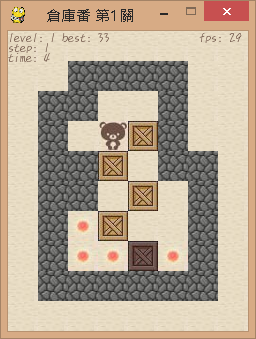

# [:octocat:PygameSokoban](https://github.com/TCCinTaiwan/PygameSokoban)
## Contents[↶](#)
* **[Introduction](#introduction)**
* **[Installation](#installation)**
* **[Usage](#usage)**

## Introduction[↶](#)
這是2016年電腦遊戲設計實務(pygame)的期末作業，是用竣煌的素材下去改寫的。


## Installation[↶](#)
1. Python:

[ ](https://www.python.org/downloads/)

>注意: 本專案使用的是Python3


>要勾"Add Python to PATH"，把Python加到環境變數中。

2. Pygame:

```bash
pip install pip --upgrade
pip install pygame
```

## Usage[↶](#)

```bash
# Go into the directory
cd PygameSokoban

# run game
python game.py
```

* 遊戲中
    + F2: 重新開始
    + F3: 上一步
    + F4: 榮譽榜
    + 上下左右/WSAD: 操控主角
    + 滑鼠點擊: 同一區自動以最短路徑走到目的地，箱子必須站在旁邊才可推動

* 排行榜
    + F2: 重新開始
    + Enter: 下一關 or 開始挑戰
    + 滑鼠點擊: 觀看紀錄